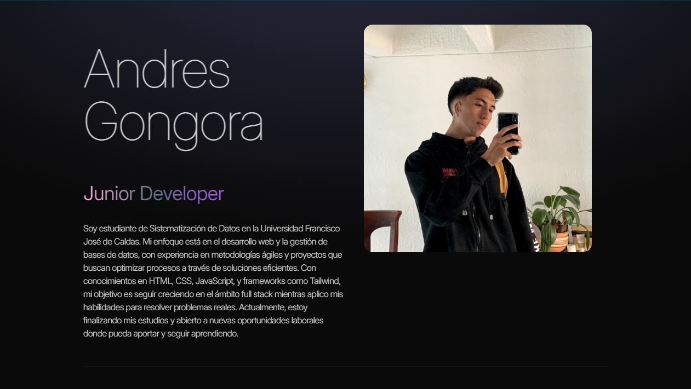

# Andrés Gongora's Portfolio



Welcome to my personal portfolio repository! This project showcases my journey and skills as a frontend developer with a focus on building dynamic and responsive web applications using modern technologies like **React**, **Tailwind CSS**, and **Vite**. You can explore my work, learn more about me, and contact me through this website.

## 🔗 Live Preview

Check out the live version of the portfolio here:
[https://your-portfolio.vercel.app](https://your-portfolio.vercel.app)

## 📋 Table of Contents

- [Features](#features)
- [Technologies](#technologies)
- [Setup](#setup)
- [Project Structure](#project-structure)
- [Future Plans](#future-plans)
- [Contributing](#contributing)

## ✨ Features

- **Responsive Design**: Optimized for desktop and mobile devices.
- **Dynamic Language Switching**: Supports both English and Spanish through a toggle switch in the navbar.
- **Modern UI**: Built with Tailwind CSS for clean, responsive styling.
- **Interactive Components**: Leveraging React for smooth user interactions.
- **Deployable with Vercel**: Fully integrated CI/CD pipeline for seamless deployment.
- **Real-time updates**: Auto-updates through GitHub-Vercel integration.

## 🛠️ Technologies

This project was built using the following technologies:

- **React**: JavaScript library for building user interfaces.
- **Tailwind CSS**: Utility-first CSS framework for rapid UI development.
- **Vite**: Next-generation frontend tooling for faster builds.
- **JavaScript**: Core programming language for frontend functionality.
- **Vercel**: For deployment, providing fast and reliable hosting with continuous integration.

## 🚀 Setup

To get a local copy of the project and run it on your machine:

1. Clone the repository:
   ```bash
   git clone https://github.com/your-username/your-portfolio-repo.git
